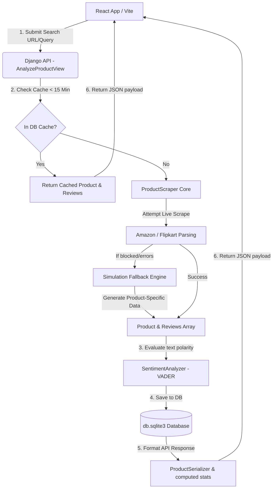

# 📊 Product Sentiment Analyzer Dashboard

<p align="center">
  
  
  
  
  
</p>

Product Sentiment Analyzer Dashboard is a premium full-stack web application designed to scan e-commerce products, crawl user reviews, perform real-time sentiment analysis using natural language processing (NLP), and visualize results in a responsive, glassmorphic analytics dashboard.

The application leverages a **Django (REST Framework)** backend coupled with an **NLTK VADER** engine and a **React (Vite)** frontend powered by **Recharts** for premium data visualization. It features a dual-mode scraping engine with an intelligent simulation fallback to bypass anti-scraping walls, and a query caching mechanism for optimized performance.

---

## 🛠️ Project Architecture Flowchart



---

## 📂 Repository Directory Layout

```text
cyber naut major project/
│
├── backend/                       # Django Backend Workspace
│   ├── analyzer/                  # Core Analysis & Scraping application
│   │   ├── migrations/            # Django database migrations
│   │   ├── admin.py               # Django admin console registrations
│   │   ├── apps.py                # Analyzer application registry
│   │   ├── models.py              # SQLite Database schemas (Product & Review)
│   │   ├── scraper.py             # E-Commerce Crawler and mock template simulator
│   │   ├── sentiment.py           # NLP VADER analyzer and word frequency generator
│   │   ├── serializers.py         # DRF serializers & custom metric calculations
│   │   ├── urls.py                # Local API routes for analyzer
│   │   └── views.py               # DRF views (caching, scraping orchestrator, detail, history)
│   │
│   ├── sentiment_backend/         # Core Django settings folder
│   │   ├── settings.py            # Global settings (CORS, DB, hosts, middleware)
│   │   ├── urls.py                # Top-level URL routing mapping /admin & /api
│   │   └── wsgi.py / asgi.py      # WSGI/ASGI web server entry points
│   │
│   ├── db.sqlite3                 # Local database storage
│   ├── manage.py                  # Django CLI administrative helper script
│   └── requirements.txt           # Python backend dependencies
│
└── frontend/                      # React Frontend Workspace
    ├── src/
    │   ├── components/            # Reusable React UI Components
    │   │   ├── HistoryList.jsx    # Left sidebar panel showing recent analyses
    │   │   ├── ProductSearch.jsx  # Search bar with progress loading animations
    │   │   ├── ReviewList.jsx     # Review table with live filtering options
    │   │   ├── SentimentTrends.jsx# Interactive Recharts analytics panels
    │   │   └── WordCloud.jsx      # Key phrase cloud and term frequency dashboard
    │   │
    │   ├── utils/
    │   │   └── api.js             # Low-level fetch requests wrapper for backend endpoints
    │   │
    │   ├── App.css                # Component-level styles
    │   ├── App.jsx                # Main dashboard workspace layout & state container
    │   ├── index.css              # Global glassmorphic styling system & utility classes
    │   └── main.jsx               # React client rendering entry point
    │
    ├── package.json               # Frontend package manager configuration
    └── vite.config.js             # Vite configurations and local backend API proxying
```

---

## ⚙️ Backend Code & Functions Reference

Click on each dropdown header below to reveal detailed code specifications and logic.

<details>
<summary><b>🐍 Configuration & settings.py Parameters</b></summary>

*   **`backend/sentiment_backend/settings.py`**:
    *   `ALLOWED_HOSTS`: Set to `['localhost', '127.0.0.1', '.onrender.com']` to allow local access and secure hosting on the Render cloud platform.
    *   `INSTALLED_APPS`: Includes core Django apps, `rest_framework` (for building the API), `corsheaders` (for handling cross-origin requests), and the custom application `analyzer`.
    *   `MIDDLEWARE`: Registers `corsheaders.middleware.CorsMiddleware` early to intercept HTTP requests and manage cross-origin access rules.
    *   `DATABASES`: Configured to use a local, zero-config file-based `sqlite3` database located at `BASE_DIR / 'db.sqlite3'`.
    *   `CORS_ALLOW_ALL_ORIGINS = True`: Set to `True` to allow communication from any port during local development or multi-cloud hosting.
</details>

<details>
<summary><b>🗄️ Database Models (models.py)</b></summary>

*   **`Product` class**:
    *   `title` *(CharField)*: The name of the product scanned.
    *   `url` *(TextField)*: Original link if crawled via e-commerce address.
    *   `platform` *(CharField)*: Set to `'Amazon'`, `'Flipkart'`, or `'Simulator'` depending on the scrape method.
    *   `avg_rating` *(FloatField)*: The calculated average score out of 5 stars from all extracted reviews.
    *   `image_url` *(TextField)*: URL pointing to the product photo.
    *   `query` *(CharField)*: The text phrase entered by the user if they searched by product name rather than link.
    *   `created_at` *(DateTimeField)*: Timestamp recording when the product analysis was initiated.
*   **`Review` class**:
    *   `product` *(ForeignKey)*: Multi-to-one mapping pointing to the parent `Product` model; triggers cascading deletion.
    *   `reviewer_name` *(CharField)*: Name of the reviewer.
    *   `rating` *(IntegerField)*: Rating given (1-5 scale).
    *   `title` *(CharField)*: Subject headline of the review.
    *   `text` *(TextField)*: Detailed feedback content.
    *   `date` *(CharField)*: Date string when the review was posted.
    *   `sentiment_label` *(CharField)*: Classification result (`'positive'`, `'negative'`, or `'neutral'`).
    *   `sentiment_score` *(FloatField)*: Compound score generated by the VADER model ranging between `-1.0` (extremely negative) and `+1.0` (extremely positive).
</details>

<details>
<summary><b>🔄 Serialization & Aggregate Analytics (serializers.py)</b></summary>

*   **`ReviewSerializer`**: Maps direct model fields into JSON objects.
*   **`ProductSerializer`**: Wraps the product details and dynamically calculates:
    *   `get_review_count(self, obj)`: Counts the total review models linked to the product.
    *   `get_sentiment_distribution(self, obj)`: Returns numbers of positive, negative, and neutral ratings alongside their percentage values (`positive_pct`, `neutral_pct`, `negative_pct`).
    *   `get_key_phrases(self, obj)`: Invokes the word density logic to extract key words for tag clouds.
</details>

<details>
<summary><b>🧠 NLP Sentiment Engine & Key Phrases (sentiment.py)</b></summary>

*   **`SentimentAnalyzer` class**:
    *   **`analyze_text(self, text)`**: Checks text types. Evaluates the text using VADER's `polarity_scores()`. If compound polarity is `>= 0.05`, the review is labeled `'positive'`. If `<= -0.05`, it is marked `'negative'`. Otherwise, it defaults to `'neutral'`.
    *   **`get_key_phrases(self, reviews, top_n=25)`**: Standardizes review text to lowercase and strips punctuation. Uses a comprehensive `stop_words` set (comprising English grammar stop words and common noise words like *product*, *item*, *amazon*, *good*, *great*) to filter out junk words. Returns a ranked array of dictionaries: `[{'text': word, 'value': count}]` representing the most frequently occurring meaningful terms.
</details>

<details>
<summary><b>🕷️ Web Scraper Core & Simulation Fallback (scraper.py)</b></summary>

*   **`ProductScraper` class**:
    *   **`scrape_product(self, target_input)`**: Detects if the user input is a URL or search phrase. Tries to initiate HTML request parsing. If blocked, it falls back to the simulator to generate a valid dataset, ensuring the frontend dashboard never displays an empty state.
    *   **`_scrape_amazon(self, url)`**: Uses `BeautifulSoup` to find tags like `#productTitle`, `#landingImage`, and cards labeled `data-hook="review"` to capture ratings, headers, authors, and text.
    *   **`_scrape_flipkart(self, url)`**: Inspects elements like `.B_NuCI` or `._2wzgFH` to scrape Flipkart product pages.
    *   **`_detect_category(self, text)`**: Scans product metadata for words like *phone*, *audio*, or *laptop* to determine the appropriate category.
    *   **`_generate_simulated_reviews(self, category)`**: Generates between 18 and 28 highly realistic reviews from pre-configured dictionaries based on the product category. Uses typical sentiment distribution (60% positive, 20% neutral, 20% negative) and randomizes dates and reviewer names.
    *   **`_get_placeholder_image(self, category)`**: Returns a high-quality product placeholder image from Unsplash matching the detected category.
</details>

<details>
<summary><b>⚡ API endpoints & caching mechanisms (views.py)</b></summary>

*   **`AnalyzeProductView`**:
    *   `post(self, request)`: Processes search queries. Checks database caching; if the same search term or URL has been analyzed within the last **15 minutes**, it returns the cached data directly (marking `cached: true`) to avoid redundant server operations. Otherwise, it triggers `ProductScraper`, executes `SentimentAnalyzer` on the reviews, performs a Django DB bulk save (`bulk_create`), recalculates average ratings, and returns the response.
*   **`ProductHistoryView`**:
    *   `get(self, request)`: Fetches all database products ordered by creation date, providing history for the sidebar logs.
*   **`ProductDetailView`**:
    *   `get(self, request, pk)`: Retrieves an analysis detail by ID.
    *   `delete(self, request, pk)`: Deletes the product and all associated reviews from the database.
</details>

---

## 🎨 Frontend React Component Reference

Click on each dropdown header below to reveal detailed code specifications and interface logic.

<details>
<summary><b>⚛️ App Shell state & handlers (App.jsx & api.js)</b></summary>

*   **State Variables**:
    *   `history`: Array of previously analyzed products.
    *   `activeProduct`: The product currently shown on the dashboard.
    *   `loading`: Boolean flag to control loading animations.
    *   `activeTab`: Controls the active view (`'trends'`, `'reviews'`, or `'cloud'`).
    *   `notification`: An object `{ type, message }` controlling toast alerts.
*   **Core Functions**:
    *   `loadHistoryList()`: Fetches the analysis history on page mount.
    *   `handleSearch(target)`: Triggers the backend scraping pipeline and updates the active dashboard view.
    *   `handleSelectHistory(id)`: Loads a previously saved product from the database.
    *   `handleDeleteHistory(id)`: Removes a product from the database and updates the history list.
    *   `renderAverageStars(rating)`: Returns visual SVG star icons representing the average rating.
*   **`utils/api.js` Integration**:
    *   `analyzeProduct(target)`: Sends a `POST` request to `/api/analyze/` with the query or URL.
    *   `fetchHistory()`: Fetches the history of previous analysis queries from `/api/history/`.
    *   `deleteHistoryItem(id)`: Sends a `DELETE` request to `/api/products/:id/`.
    *   `fetchProductDetail(id)`: Fetches details for a single product from `/api/products/:id/`.
</details>

<details>
<summary><b>🔍 Search Bar Loader Logger (ProductSearch.jsx)</b></summary>

*   **Console step Logger animation**:
    When the loading flag is activated, the component displays an interactive terminal list logging live extraction phases every 1.1 seconds:
    1. *"Resolving search query or URL..."*
    2. *"Connecting to e-commerce scraping engine..."*
    3. *"Bypassing bot-detection firewalls..."*
    4. *"Parsing HTML structures & extracting raw reviews..."*
    5. *"Analyzing text with NLTK VADER sentiment model..."*
    6. *"Generating key phrase word distributions..."*
    7. *"Finalizing SQL schema inserts & rendering dashboard..."*
</details>

<details>
<summary><b>📈 Interactive Recharts Charts (SentimentTrends.jsx)</b></summary>

*   **Recharts Data Visualizers**:
    *   **Sentiment Breakdown (Donut Chart)**: Visualizes overall positive (Emerald green `#10b981`), negative (Red `#ef4444`), and neutral (Purple `#8b5cf6`) percentages.
    *   **Sentiment vs Rating (Stacked Bar Chart)**: Compares VADER sentiments against star ratings (1 to 5).
    *   **Sentiment Chronology (Linear Wave Chart)**: Plots VADER compound scores chronologically with customized gradient line waves (`#4facfe` to `#00f2fe`) to trace user polarity over time.
</details>

<details>
<summary><b>🏷️ Dynamic Word Clouds (WordCloud.jsx)</b></summary>

*   **Visual density scaling calculations**:
    *   The font size of each word is scaled dynamically on a normalized range based on maximum and minimum count values:
        $$\text{size} = 0.85\text{rem} + \left( \frac{\text{val} - \text{min}}{\text{max} - \text{min}} \right) \times 0.90\text{rem}$$
    *   Highly recurring words are wrapped in a blue glow overlay.
    *   Features a ranked **Keyword Density Leaderboard Table** mapping count percentages dynamically via percentage gauge bars.
</details>

<details>
<summary><b>📋 Reviews Filters Grid (ReviewList.jsx)</b></summary>

*   **Features**:
    *   **Case-insensitive Search**: Filters reviews by keywords found inside text content, author names, or titles.
    *   **Filters**: Integrates options to filter reviews by sentiment types or rating ranges (1-5 stars) dynamically without calling the backend API.
</details>

---

## 🚀 Installation & Local Launch Guide

### 1. Backend Server Setup
Navigate into the `backend/` directory, set up your python environment, install requirements, and run local database updates:

```bash
# 1. Access backend folder
cd backend

# 2. Setup python virtual environment
python -m venv venv

# 3. Activate venv
# Windows (PowerShell):
.\venv\Scripts\Activate.ps1
# macOS/Linux:
source venv/bin/activate

# 4. Install requirements
pip install -r requirements.txt

# 5. Build database schemas & migrations
python manage.py migrate

# 6. Start server
python manage.py runserver 127.0.0.1:8000
```
> [!NOTE]
> The backend server will run on `http://127.0.0.1:8000/`.

---

### 2. Frontend React Launch
Open a new console tab, navigate into the `frontend/` directory, configure packages, and start the Vite local server:

```bash
# 1. Access frontend folder
cd frontend

# 2. Install packages
npm install

# 3. Start development server
npm run dev
```
> [!TIP]
> The local development environment will run on `http://localhost:5173/`. Vite proxies API calls starting with `/api` directly to port `8000`.

---

## ☁️ Production Deployment

### Backend Hosting (e.g. Render)
*   **Engine**: `Python`
*   **Build Command**: `pip install -r backend/requirements.txt && python backend/manage.py migrate`
*   **Start Command**: `gunicorn --chdir backend sentiment_backend.wsgi:application`
*   **Environment Settings**:
    *   `PYTHON_VERSION` = `3.10.x` (or newer)
    *   `DEBUG` = `False`
    *   `SECRET_KEY` = *(Configure a secure secret key)*

### Frontend Hosting (e.g. Vercel)
*   **Root Directory**: `frontend`
*   **Build Command**: `npm run build`
*   **Output Directory**: `dist`
*   **Environment Settings**:
    *   `VITE_API_BASE_URL` = `https://your-backend-url.onrender.com/api` (points directly to your deployed backend url).

---

## 🔐 Administrative Console & Database Management

Django features a built-in admin panel (`/admin/`) to view database schemas, manage records, and clean search history profiles.

### 1. Generating a Superuser Account
Since credentials should not be hardcoded in version control, you must generate a superuser account on your local host terminal:

```bash
# Execute within active virtual environment folder
python manage.py createsuperuser
```

Input your details step-by-step:
1.  **Username**: E.g., `admin`
2.  **Email address**: *(Press enter to skip)*
3.  **Password**: *(Type a secure password; characters are hidden during input)*
4.  **Confirm Password**: *(Re-enter password)*

Once verified, navigate to `http://127.0.0.1:8000/admin/` to log in.

> [!WARNING]
> Ensure **DEBUG** is set to `False` in production `settings.py` files to prevent configuration parameters and secret keys from being leaked in debug panels.

---

### 2. Registering Analyzer Models in Admin Panel
To view and manage `Product` and `Review` models in the Django admin interface, register them in your backend app code at [admin.py](file:///d:/PAPER%20RESEARCH/cyber%20naut%20major%20project/backend/analyzer/admin.py):

```python
from django.contrib import admin
from .models import Product, Review

@admin.register(Product)
class ProductAdmin(admin.ModelAdmin):
    list_display = ('title', 'platform', 'avg_rating', 'created_at')
    search_fields = ('title', 'query')
    list_filter = ('platform', 'created_at')

@admin.register(Review)
class ReviewAdmin(admin.ModelAdmin):
    list_display = ('product', 'reviewer_name', 'rating', 'sentiment_label', 'sentiment_score')
    search_fields = ('reviewer_name', 'text', 'title')
    list_filter = ('sentiment_label', 'rating')
```
